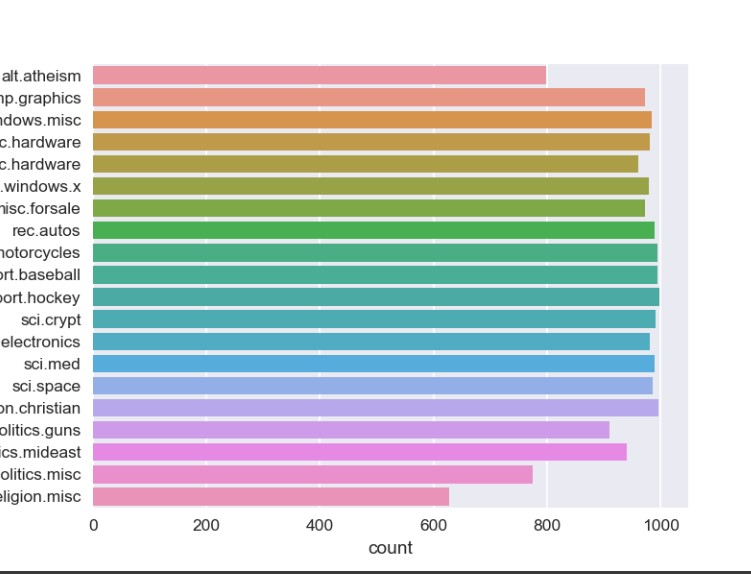

# Document Classification Using CNN : Leveraging CNN for efficient text categorization.

The goal is to develop a document classifier that can accurately categorize a collection of 18,828 text documents into one of 20 predefined classes Using Convolution Neural Network. Each document is named in the format 'ClassLabel_DocumentNumberInThatLabel', allowing the extraction of the corresponding label for each document

## Table of Contents
1. ML problem formulation
2. Downloading dataset.
3. Data description.
4. Exploring target count(labels).
5. Evaluation Metric.
6. Data preprocessing.
7. Model architecture.
8. Results.

## 1. ML problem formulation
- This is a Multi-class classification problem.
- At outset, it looks like there is no low latency requirement

## 2. Downloading dataset
- Use this link for the [dataset](https://drive.google.com/open?id=1rxD15nyeIPIAZ-J2VYPrDRZI66-TBWvM)
- Note: the above folder is zipped, so use the below code to extract the files.
```python
!pip install unrar
!unrar x documents.rar
```
## 3. Data Description
- There are a total of 18,828 text documents comprising 20 types.
- Each document file name is defined as 'ClassLabel_DocumentNumberInThatLabel'. So from the document name, you can extract the label and number for that document. Moreover, you extract text present in that text file.

## 4. Exploring target

- As you can observe, the dataset is evenly balanced.

## 5. Evaluation metric
- Use Micro-Averaged F1 score.

## 6. Data preprocessing
- Below are the preprocessing steps

1. Find all emails in the document and then get the text after the "@". and then split those texts by '.'
after that remove the words whose length is less than or equal to 2 and also remove'com' word and then combine those words by space.

2. Replace all the emails by space in the original text.

3. Get subject of the text i.e. get the total lines where "Subject:" occur and remove
the word which are before the ":" remove the newlines, tabs, punctuations, any special chars.

4. After you store it in the list, Replace those sentences in original text by space.

5. Delete all the sentances where sentence starts with "Write to:" or "From:".

6. Delete all the tags like "< anyword >"

7. Delete all the data which are present in the brackets.
In many text data,it is observed that, they maintained the explanation of sentence
or translation of sentence to another language in brackets so remove all those.

8. Remove all the newlines('\n'), tabs('\t'), "-", "\".

9. Remove all the words which ends with ":".

10. Decontractions, replace words like below to full words.
Eg: can't -> can not, 's -> is, i've -> i have, i'm -> i am, you're -> you are, i'll --> i will 


11. Perform chunking on the text you have after above preprocessing.
Text chunking, also referred to as shallow parsing, is a task that
follows Part-Of-Speech Tagging and that adds more structure to the sentence.

13. Replace all the digits with space i.e delete all the digits.

14. After doing above points, we observed there might be few word's like
  "_word_" (i.e starting and ending with the _), "_word" (i.e starting with the _),
  "word_" (i.e ending with the _) remove the _ from these type of words.

15.  It is also observed some words like  "OneLetter_word"- eg: d_buffalo,
"TwoLetters_word" - eg: dr_buffalo , in these words we remove the "OneLetter_" (d_berlin ==> berlin) and
"TwoLetters_" (de_berlin ==> berlin). i.e remove the words
which are length less than or equal to 2 after spliiting those words by "_".

16. Convert all the words into lower case
and remove the words which are greater than or equal to 15 or less than or equal to 2.

17. replace all the words except "A-Za-z_" with space.

18. Combine "preprocessed_text", "preprocessed_subject", "preprocessed_emails" into one column. Use that column to model.


## 7. Model Architecture
- Model 1 : Word embeddings is based on pretrained Glove vector where each embedding has size 300 dimensions.
  
  
- Model 2 : **[Char CNN](http://arxiv.org/abs/1509.01626)** char embeddings is based on pretrained char embeddings from https://github.com/minimaxir/char-embeddings/blob/master/glove.840B.300d-char.txt
  

## 8. Results


